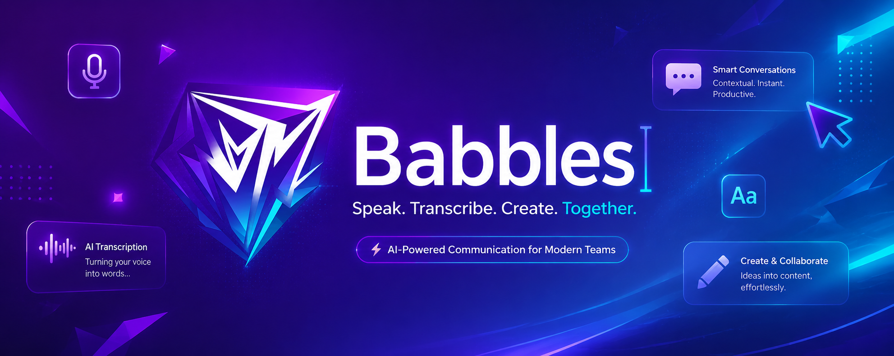
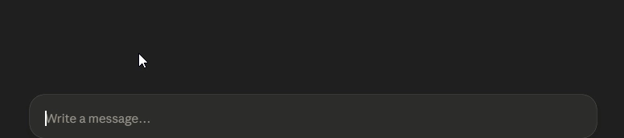

</img>


</img>


# <h1 style = "color : rgba(166, 30, 220, 1); font-size : 70px ; font-weight : 900"> Babbles </h1>

## Babbles is a lightweight, local-first speech-to-text desktop application for Windows. It uses **[faster-whisper](https://github.com/SYSTRAN/faster-whisper)** backed by **CTranslate2** to run **OpenAI's Whisper model** directly on your GPU And CPU — no cloud, no API keys.
<br>


<br>

> **Hold `Ctrl + Space` → speak → release → text appears in the active window.** <br>
> **Also you can use toogle hotkey `Ctrl + Alt + Space` to start/stop listening.**

> **Recommended to use `Whisper-small` give high results while uses low space and high performance in GPU mode as well as CPU mode.**

---


## Features

| Feature | Details |
|---|---|
| **Global hotkey** | `Ctrl + Space` (Hold) or `Ctrl + Alt + Space` (Toggle) |
| **Microphone Selection** | Dynamically switch active input device via Settings |
| **GPU-accelerated** | CUDA + float16 via CTranslate2 (RTX-series) |
| **In-memory audio** | No WAV files ever written to disk |
| **Built-in VAD** | faster-whisper's VAD filter ignores silence/noise |
| **Smart paste** | Clipboard save → Ctrl+V → clipboard restore |
| **Animated overlay** | Listening waveform + Transcribing dots at screen bottom |
| **System-tray icon** | Right-click for Toggle Dictation / Settings / Quit |
| **Modern UI** | Settings window via CustomTkinter (incl. Terminal visibility toggle) |

---

## Quick Start

See **[SETUP.md](docs/SETUP.md)** for the full setup guide.

```bash
# After creating your venv and installing dependencies:
python main.py

# Activate the python virtual environment
# All the below steps should be done in the virtual environment terminal, not normal terminal.
python .\venv\Scripts\activate

# Upgrading pip and installing the requirements
pip install --upgrade pip
pip install -r requirements.txt

# run main.py
py main.py
```

---

## Project Structure

```
babbles/
├── main.py              # Entry point
├── config.json          # User settings
├── README.md            ← you are here
├── requirements.txt
├── .gitignore
├── babbles_logo.ico     # App tray icon
├── run_babbles.bat      # Auto-elevating launcher
├── build_exe.ps1        # Build script
├── core/
│   ├── audio.py         # Microphone capture (sounddevice)
│   ├── hotkey.py        # Global Ctrl+Space listener
│   ├── transcriber.py   # faster-whisper engine
│   └── output.py        # Clipboard paste
├── ui/
│   ├── overlay.py       # Animated listening overlay
│   ├── tray.py          # System-tray icon
│   └── settings_ui.py   # Settings window
├── models/              # Pre-downloaded Whisper models
└── docs/
    ├── ARCHITECTURE.md
    ├── CHANGELOG.md
    ├── SETTINGS.md
    └── SETUP.md
```

---

## Documentation Style

**Every change, optimisation, or new feature MUST be recorded in [CHANGELOG.md](docs/CHANGELOG.md) and reflected in [ARCHITECTURE.md](docs/ARCHITECTURE.md) before the task is considered complete.**
